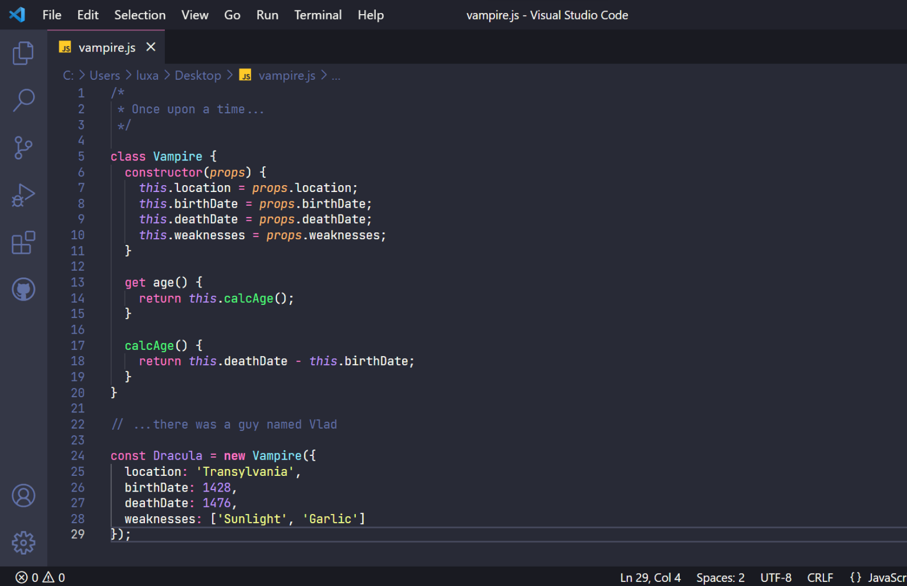

# Dracula for [Gittyup](https://murmele.github.io/Gittyup/)

> A dark theme for [Gittyup](https://murmele.github.io/Gittyup/).

_Old Screenshot_

## Install

All instructions can be found at [draculatheme.com/gittyup](https://draculatheme.com/gittyup).

## Team

This theme is maintained by the following person(s) and a bunch of [awesome contributors](https://github.com/dracula/foobar/graphs/contributors).

|  |
| ---------------------------------------------------------------------------------------- |
| [Stephan Langenau](https://github.com/kaeptnkrunch)                                               |

## Contributing

Feel free to help me develop this extension by submitting pull requests! You can view a list of contributors [here](https://github.com/dracula/gittyup/graphs/contributors)

## Questions

If you have an problems getting something to work please email me at <stephanlangenau@gmail.com> or file a [Github Issue](https://github.com/dracula/gittyup/issues)

## Social

- [Twitter](https://twitter.com/kaeptnkrunch) - My Twitter

## License

[MIT License](./LICENSE)